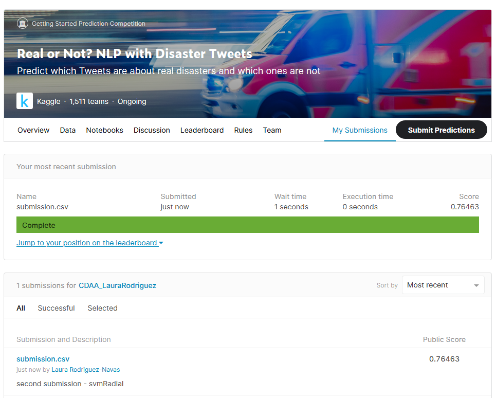

```{r setup, include=FALSE}
knitr::opts_chunk$set(echo = TRUE)
```

\newpage

Empezamos por cargar a nuestro espacio de trabajo los paquetes que usaremos:

- **tidyverse**, engloba otros paquetes (**dplyr**, **tidyr**, **ggplot**, etc.) que facilitan en gran medida el análisis exploratorio de los datos.
- **tm**, específico para minería de textos.
- **irlba**, específico para *Descomposición de Valores Singulares (SVD)* de matrices enormes.
- **caret**, para realizar tareas de clasificación y regresión.
- **doParallel**, proporciona computación paralela.
- **syuzhet**, específico para la extracción de sentimientos de textos.
- **ggcorrplot**, muestra visualizaciones gráficas de matrices de correlación usando *ggplot2*.

```{r message=FALSE}
library(tidyverse)
library(tm)
library(irlba)
library(caret)
library(doParallel)
library(syuzhet)
library(ggcorrplot)
```

# Análisis exploratorio de los datos

Antes de entrenar un modelo predictivo, o incluso antes de realizar cualquier cálculo con un nuevo conjunto de datos, es muy importante realizar una exploración descriptiva de los datos. Este proceso nos permite entender mejor que información contienen cada variable, detectar posibles errores, etc. además, puede dar pistas sobre qué variables no son adecuadas para predecir un modelo. 

Acorde a la realización del ejercicio propuesto se ha elegido la competición en Kaggle: **Real or Not? NLP with Disaster Tweets**. El dataset de la competición se puede encontrar en el siguiente enlace: https://www.kaggle.com/c/nlp-getting-started/data. Este dataset, con 10.876 instancias, contiene 4 variables explicativas: **id**, **keyword**, **location** y **text**, y dos valores en la variable clase **target** (0 y 1). Como podemos observar la variable clase es binaria, así que, durante este ejercicio vamos a aprender un modelo de *clasificación binaria*. El objetivo de este modelo será predecir si dado un tweet, éste trata sobre un desastre real o no. Si un tweet trata sobre un desastre real, se predice un 1. Si no, se predice un 0.

*La clasificación binaria es un tipo de clasificación en el que tan solo se pueden asignar dos clases diferentes (0 o 1).*

La métrica de evaluación esperada por la competición es **F1 score**. Para ver como se calcula consultar el siguiente enlace: https://www.kaggle.com/c/nlp-getting-started/overview/evaluation.

La partición inicial train-test, no se tiene que realizar, ya que las instancias de train y test ya vienen definidas en el dataset de la competición (descargar a nuestro espacio de trabajo los ficheros **train.csv** y **test.csv** de https://www.kaggle.com/c/nlp-getting-started/data). 

Cargamos a nuestro espacio de trabajo los conjuntos de datos de train y test descargados, renombrando los valores perdidos como **NA** para que los podamos tratar más adelante. También mostramos las dimensiones de los conjuntos de datos usando la función **dim**. 

```{r}
train <- read.csv("train.csv", na.strings=c("", "NA"))
test <- read.csv("test.csv", na.strings=c("", "NA"))
dim(train)
dim(test)
```

Vemos que el conjunto de datos de train contiene 7613 instancias y el conjunto de datos de test contiene 3263 instancias. Cada instancia contiene las siguientes variables:

- **id**: un identificador único para cada tweet. 
- **keyword**: una palabra clave del tweet.
- **location**: la ubicación desde la que se envió el tweet.
- **text**: el texto del tweet. 
- **target**: solo en el conjunto de datos de train porqué es la variable clase a predecir. Indica si un tweet corresponde a un desastre real (1) o no (0). 

```{r echo=FALSE}
str(train, width = 85, strict.width = "cut")
str(test, width = 85, strict.width = "cut")
```

## Variable *target*

Como ya hemos comentado, la variable **target** es la variable a predecir. Es de tipo cuantitativa (de tipo entero) y conviene convertirla a variable cualitativa, almacenarla con el tipo *factor*. Para evitar errores, se recodifica para que sus dos posibles valores sean "Yes"-"No" y se convierte a *factor*.

```{r fig.align='center', out.width='70%'}
train$target <- as.factor(ifelse(train$target == 0, "No", "Yes"))
ggplot(train, aes(x=target)) + geom_bar(aes(fill=target))
```

Cuando se crea un modelo, es muy importante estudiar la distribución de la variable clase, ya que, a fin de cuentas, es lo que nos interesa predecir. 

Gráficamente observamos que la distribución de la variable a predecir no está muy sesgada y está relativamente equilibrada. Hay menos tweets que se refieren a desastres reales. Además, parece que no presenta un problema notable de *desbalanceo de clase*, porqué contamos con muchas observaciones del caso minoritario.

```{r}
sum(train$target == "Yes") / dim(train)[1] * 100
sum(train$target == "No") / dim(train)[1] * 100
```

Para que un modelo predictivo nos sea útil tendremos que intentar superar el porcentaje mínimo dado que aproximadamente el 57% de los tweets no representan un desastre real (este porcentaje se recalculará únicamente con el conjunto de datos de train).

Como el objetivo del ejercicio es predecir que tweets pertenecen o no a un desastre real, el análisis que haremos a continuación se hace realiza de cada variable explicativa con relación a la variable a predecir **target**. Analizando de esta forma, se pueden extraer ideas sobre que variables están más relacionadas con los desastres reales.

## Variable *keyword*

La variable explicativa **keyword** representa una palabra clave en cada tweet. Vemos las 10 primeras del conjunto de datos de train.

```{r}
train %>% select(keyword) %>% unique() %>% head(10)
```

Nuestro interés en la variable **keyword** dentro del análisis exploratorio de los datos es ver si existen correlaciones entre esta y la variable a predecir **target**. Para ello, y como estamos delante un ejercicio de *Procesamiento del Lenguaje Natural* realizaremos un análisis de sentimientos.

*El análisis de sentimientos es una técnica de [Machine Learning](https://en.wikipedia.org/wiki/Machine_learning), basada en el [Procesado del Lenguaje Natural](https://www.kdnuggets.com/2017/02/natural-language-processing-key-terms-explained.html), que pretende obtener información subjetiva de una serie de textos. Su aplicación es este caso, consiste en resolver si un tweet es real o no en relación a un desastre.*

En el análisis de sentimientos usamos los paquetes de R: **syuzhet**, **ggcorrplot** y **doParallel**.

- El paquete **syuzhet** cuenta con la función **get_nrc_sentiment** que calculará la presencia de los diferentes sentimientos dado un conjunto de palabras clave. 
Los argumentos de esta función son:
  - **char_v**. Un vector de caracteres que en este caso contendrá todas las palabras clave.
  - **language**. Define el lenguaje. Como los tweets están en inglés, el lenguaje será el inglés.
  - **cl**. Para el análisis en paralelo. Es opcional, pero en este caso lo usaremos porqué hay muchas palabras clave.
- El paquete **doParallel** cuenta con las funciones:
  - **makePSOCKcluster**. Crea un clúster de sockets paralelos.
  - **registerDoParallel**. Registra el número de *cores* que usará el clúster creado. 
  - **stopCluster**. Detiene la computación paralela.
  
La computación paralela la usaremos en muchas de las ejecuciones de este ejercicio ya que nos encontramos delante de un problema de *alta dimensionalidad*. Eso es, que la dimensionalidad de nuestros datos es muy elevada y puede reducir drásticamente la eficiencia de los algoritmos de clasificación supervisada que entrenaremos.

La reducción de la dimensionalidad que aplicaremos en este ejercicio se realiza más adelante y se calculará teniendo en cuenta las palabras más frecuentes de los tweets en conjunto de datos.

El análisis de sentimientos de cada palabra clave, usando la función **get_nrc_sentiment**, consiste en extraer los sentimientos de cada palabra clave, guardarlos en un nuevo conjunto de datos (*emotion.df*), con el que calcularemos (paquete **cor**) y visualizaremos la matriz de correlaciones (paquete **ggcorrplot**) entre las palabras clave con relación a la variable a predecir. Es importante volver a transformar la variable a predecir para realizar los cálculos, cuando la variable es cualitativa.

```{r warning=FALSE, fig.align='center'}
cl <- makePSOCKcluster(4, setup_strategy="sequential")
registerDoParallel(cl)

emotion.df <- get_nrc_sentiment(char_v = gsub("_", " ", train$keyword), 
                                language = "english", cl=cl)

emotion.df <- emotion.df %>% data.frame(target = train$target)

emotion.df$target <- as.numeric(emotion.df$target)

cor(emotion.df) %>% 
  ggcorrplot(lab = TRUE, 
             title = "Matriz de correlación entre \nkeyword y target",
             legend.title = "correlation")

stopCluster(cl)
```

Parece que, al observar la matriz de correlaciones, existe una correlación nula entre las variables **keyword** y **target**. Al revisarlo con mayor detalle, podemos observar que la mayoría de las palabras clave no tienen un sentimiento positivo asociado. Las palabras clave asociadas a un sentimiento se asocian negativamente (miedo o tristeza), lo cual es bastante consistente con el problema, ya que intentemos predecir el desastre. 

Acorde a nuestro criterio esta variable explicativa no es buena para hacer una predicción ya que no está realmente asociada con la variable a predecir. Así que la excluiremos del procesamiento de texto.

## Variable *location*

La variable explicativa **location** representa las ubicaciones desde donde se generaron los tweets. Vemos las 10 primeras y el número total de ubicaciones diferentes del conjunto de datos de train (3342 ubicaciones).

```{r}
train %>% select(location) %>% unique() %>% head(10)
count(train %>% select(location) %>% unique())
```

A continuación, veremos las ubicaciones que se repiten más de 10 veces en el conjunto de datos de train.

```{r fig.align='center', out.width='70%'}
location.freq <- table(unlist(train %>% select(location)))
location.freq[which(location.freq > 10)]
barplot(location.freq[which(location.freq>10)], las = 2,  
        ylab = "frequency")
```

En el total de ubicaciones, 3342, la mayoría de ellas cuenta con menos de 10 observaciones. Acorde a nuestro criterio esta variable explicativa no es buena para hacer una predicción, ya que la variable tiene muy pocas observaciones, y puede ocurrir que, durante la validación cruzada o *bootstrapping*, algunas de las particiones no contengan ninguna observación de dicha variable, lo que puede dar lugar a errores.

*Una muestra bootstrap es una muestra obtenida a partir de la muestra original por muestreo aleatorio con reposición, y del mismo tamaño que la muestra original. Muestreo aleatorio con reposición (resampling with replacement) significa que, después de que una observación sea extraída, se vuelve a poner a disposición para las siguientes extracciones. Como resultado de este tipo de muestreo, algunas observaciones aparecerán múltiples veces en la muestra bootstrap y otras ninguna.*

## Variable *id*

La variable **id** es solo un identificador único, así que, no la analizaremos y procederemos a eliminarla de los conjuntos de datos de train y test.

```{r}
train$id <- NULL
test$id <- NULL
```

## Conclusión análisis exploratorio

Llegados a este punto, parece que nuestro criterio en la exploración de los datos, el estudio de su distribución y sus posibles relaciones con la variable a predecir nos indica que las variables explicativas **keyword**, **location** y **id** no son buenas para hacer una predicción, así que nos centraremos en la variable **text** para hacer la predicción. 

# Procesamiento de texto

Combinamos los conjuntos de datos de train y test para ahorrar esfuerzos en el preprocesado de datos. Para ello, usamos la función **bind_rows**, que nos permitirá enlazar de forma eficiente los conjuntos de datos por fila y columna. Podremos comprobar que la combinación se hace correctamente, sumando los elementos de train (7613) y de test (3263), el nuevo conjunto de datos (**complete_df**) tendrá 10876 observaciones, 3 variables explicativas (**keyword**, **location**, **text**) y la variable de clase **target**.

```{r}
complete_df <- bind_rows(train, test)
str(complete_df, width = 85, strict.width = "cut")
```

El preprocesado de datos englobará las transformaciones de los textos, como, por ejemplo, la imputación de valores ausentes o la reducción de dimensionalidad.

Primero, miramos cuantos valores perdidos tiene nuestro conjunto de datos **complete_df**. La función **colSums** sumará los valores que la función **sapply** encuentre, en este caso, los valores perdidos.

```{r}
colSums(sapply(complete_df, is.na))
```

Identificamos que las variables explicativas **keyword** y **location** tienen valores perdidos. La variable explicativa **text** no tiene valores perdidos. Sobretodo hay una gran cantidad de tweets, para los cuales falta su ubicación. Los 3263 valores perdidos de la variable a predecir provienen del conjunto de datos de test. Nos ocuparemos de los valores perdidos más adelante.

## Corpus

Con nuestro nuevo conjunto de datos preparado (**complete_df**), procedemos a crear nuestro Corpus, es decir, el conjunto de textos de la variable **text** a analizar. En este caso, nuestro Corpus se compone de todos los textos de los tweets y los asignaremos al objeto *myCorpus* usando las funciones **VectorSource** y **Corpus**. La función **Corpus** creará el corpus a partir de un vector de textos. La función **VectorSource** interpretará cada mensaje de texto de los tweets como un elemento de ese vector de textos.

*Un corpus lingüístico se define como "un conjunto de textos de un mismo origen" y que tiene por función recopilar un conjunto de textos. El uso de un corpus lingüístico nos permitirá obtener información de las palabras utilizadas con más o menor frecuencia.*

```{r}
myCorpus <- Corpus(VectorSource(complete_df$text))
myCorpus
```

Como podemos ver, nuestro Corpus está compuesto por 10876 textos.

## Limpieza del texto

Necesitamos limpiar de los 10876 textos caracteres que son de poca utilidad. Empezamos por aseguramos de que no queden enlaces, con un poco de ayuda de las *regular expressions*. Para ello usaremos las funciones **gsub** y **tm_map**. La función **gsub** buscará y reemplazará desde la primera hasta la última de las coincidencias de un patrón (representado por una *regular expression*). La función **tm_map** será la encargada de aplicar las diferentes transformaciones de los textos a nuestro corpus.

*Una expresión regular (o en inglés regular expression) es una representación, según unas reglas sintácticas de un lenguaje formal, de una porción de texto genérico a buscar dentro de otro texto, como por ejemplo caracteres, palabras o patrones de texto concretos.*

```{r warning=FALSE}
removeURL <- function(x) gsub("http[^[:space:]]*", "", x)  
myCorpus <- tm_map(myCorpus, content_transformer(removeURL))
```

Convertimos todo a minúsculas.

```{r warning=FALSE}
myCorpus <- tm_map(myCorpus, content_transformer(tolower))
```

Eliminamos los nombres de usuario.

```{r warning=FALSE}
removeUsername <- function(x) gsub("@[^[:space:]]*", "", x)  
myCorpus <- tm_map(myCorpus, content_transformer(removeUsername))
```

Nos deshacemos de la puntuación, puesto que por ejemplo "fin" y "fin." son identificadas como palabras diferentes, lo cual no deseamos.

```{r warning=FALSE}
removeNumPunct <- function(x) gsub("[^[:alpha:][:space:]]*", "", x)   
myCorpus <- tm_map(myCorpus, content_transformer(removeNumPunct))
```

Usamos **removeWords** con **stopwords("english")**, recordemos que los textos de los tweets están en inglés y cada idioma tiene sus propias palabras vacías; para eliminar palabras vacías, es decir, aquellas con poco valor para el análisis, que carecen de un significado por si solas, tales como artículos, preposiciones, conjunciones, pronombres, etc. 

```{r warning=FALSE}
myStopWords <- c((stopwords('english')), 
    c("really", "tweets", "saw", "just", "feel", "may", "us", "rt", "every", "one",
     "amp", "like", "will", "got", "new", "can", "still", "back", "top", "much",
     "near", "im", "see", "via", "get", "now", "come", "oil", "let", "god", "want",
     "pm", "last", "hope", "since", "everyone", "food", "content", "always", "th",
     "full", "found", "dont", "look", "cant", "mh", "lol", "set", "old", "service",
     "city", "home", "live", "night", "news", "say", "video", "people", "ill", 
     "way",  "please", "years", "take", "homes", "read", "man", "next", "cross", 
     "boy", "bad", "ass"))

head(myStopWords, 30)
myCorpus <- tm_map(myCorpus, removeWords, myStopWords) 
```

Además, podemos ver que se han añadido (aleatoriamente) más palabras vacías ("really", "tweets", "saw", etc.). Estas palabras vacías son de las más usadas en los mensajes de texto de los tweets (ver https://techland.time.com/2009/06/08/the-500-most-frequently-used-words-on-twitter/).

En este caso, removemos las palabras de una sola letra.

```{r warning=FALSE}
removeSingle <- function(x) gsub(" . ", " ", x)   
myCorpus <- tm_map(myCorpus, content_transformer(removeSingle))
```

Por último eliminamos los espacios vacíos excesivos, muchos de ellos introducidos por las transformaciones anteriores.

```{r warning=FALSE}
myCorpus <- tm_map(myCorpus, stripWhitespace)
```

# Creación de un modelo predictivo

## Preprocesado de los datos

Para la creación de un modelo predictivo, necesitamos construir una **Term Document Matrix** del conjunto de textos de la variable **text**, donde cada fila representará un texto y cada palabra única estará representada per una columna.

*Una Term Document Matrix es una matriz matemática que describe la frecuencia con la que se repiten una serie de palabras en una colección de documentos.*

Comenzaremos mapeando nuestro Corpus indicando que es una **Term Document Matrix**, de esta manera podremos realizar el preprocesado de datos. Sabemos que el preprocesado de datos engloba aquellas transformaciones de los datos con la finalidad de mejorar los resultados de la clasificación supervisada. Todo preprocesado de datos debe aprenderse de las observaciones de train y luego aplicarse al conjunto de train y de test. Esto es muy importante para no violar la condición de que ninguna información procedente de las observaciones de test influya en el ajuste del modelo.

Utilizaremos la función **TermDocumentMatrix** en nuestro Corpus y asignaremos el resultado al objeto *complete.tdm*. Con el parámetro **control** indicaremos que evaluaremos todos los textos de la matriz, con las características escogidas se evaluarán todas las palabras de los textos. Por defecto la función **TermDocumentMatrix** usa *tf-id*, que mide la importancia relativa de cada palabra en el conjunto de textos. 

```{r}
complete.tdm <- TermDocumentMatrix(myCorpus, control=list(wordLengths= c(4, Inf)))
complete.tdm
```

Podemos observar que tenemos 16880 *terms*, esto quiere decir que tenemos 16880 palabras diferentes en nuestro Corpus. Lo cual es una cantidad considerable de vocabulario, pero no esperaríamos otra cosa de una red social como [Twitter](https://twitter.com). La palabra más larga contiene 49 caracteres.

Usaremos la función **removeSparseItems** para depurar nuestra **Term Document Matrix** de aquellas palabras que aparecen con muy poca frecuencia, es decir, son dispersas. Porqué 16880 palabras son demasiadas palabras y es posible que no podamos entrenar nuestro modelo debido a restricciones computacionales.

Esta función requiere que especifiquemos el argumento **sparse**, que puede asumir valores de 0 a 1. Este valor representa la dispersión de las palabras que queremos conservar. Si lo fijamos muy alto (cerca de 1, pero no 1), conservaremos muchas palabras, casi todas, pues estamos indicando que queremos conservar palabras, aunque sean muy dispersas. Naturalmente, ocurre lo opuesto si fijamos este valor muy bajo (cerca de 0, pero no 0), pudiendo incluso quedarnos sin ninguna palabra, si las palabras en nuestros textos son dispersas en general.

En este caso, se decide fijarlo en *.9975*, conservando las palabras que aparecen en al menos el 0.25% de las observaciones.

```{r}
complete.tdm <- removeSparseTerms(complete.tdm, sparse = .9975)
complete.tdm
```

De 16880 palabras que teníamos, nos hemos quedado con 582, lo cual reduce en gran medida la dificultad y complejidad del problema de *alta dimensionalidad*, lo cual es deseable. La palabra más larga contiene 17 caracteres.

### Feature Extraction mediante Singular Value Decomposition

La descomposición de los datos originales en un nuevo conjunto, sin necesidad de pérdida de información relevante y sacando a la luz la información latente, es un proceso de vital importancia para implementar la parte más computacionalmente intensa del ejercicio. Buscando una intuitiva separabilidad de las clases de los datos aplicaremos la técnica de *Descomposición en Valores Singulares (SVD)*.

*La Descomposición de Valores Singulares (en inglés Singular Value Decomposition ([SVD] (https://en.wikipedia.org/wiki/Singular-value_decomposition)) es una técnica de reducción de la dimensionalidad, en minería de textos, que puede utilizarse para descubrir las dimensiones latentes (o componentes) que determinan similitudes semánticas entre las palabras (es decir, unidades léxicas) o entre los textos (es decir, unidades de contexto).*

Para aplicar la técnica de *Descomposición en Valores Singulares (SVD)*, primero transformamos nuestra **Term Document Matrix** a un objeto de tipo **matrix** para así poder comprobar si nuestros datos aún contienen valores perdidos con la función **which**.

```{r echo=FALSE}
complete.term.matrix <- as.matrix(t(complete.tdm))
which(!complete.cases(complete.term.matrix))
```

Los datos no contienen valores perdidos, podemos proceder con la *Descomposición de Valores Singulares (SVD)*. Para ello utilizamos la función **irlba**, que se encargará de la descomposición de nuestra **Term Document Matrix** y extraerá sus 150 vectores singulares más importantes, después de un máximo de 600 iteraciones, y que guardaremos en el objeto **complete_irlba**. 

```{r}
cl <- makePSOCKcluster(4, setup_strategy="sequential")
registerDoParallel(cl)

complete_irlba <- irlba(t(complete.term.matrix), nv = 150, maxit = 600)
complete_irlba$v[1:10, 1:5]

stopCluster(cl)
```

Lo que vemos arriba es una pequeña parte del modelo de espacio vectorial de los 150 vectores singulares más importantes, que usaremos como características para la clasificación supervisada.

## División de los datos en train y test

Evaluar la capacidad predictiva de un modelo consiste en comprobar cómo de próximas son sus predicciones a los verdaderos valores de la variable a predecir. Para poder cuantificar de forma correcta este error, se necesita disponer de un conjunto de observaciones, de las que se conozca la variable a predecir, pero que el modelo no haya "visto", es decir, que no hayan participado en su ajuste. Con esta finalidad, se dividen los datos disponibles en un conjunto de train y un conjunto de test.

Con el conjunto de datos, del que se conoce la variable a predecir (**complete_df**) y las características que hemos creado en la sección anterior (**complete_irlba**) creamos un nuevo conjunto de datos que a continuación dividiremos en un conjunto de datos de train (**train.df**) y de test (**test.df**), con el mismo tamaño de la partición inicial proporcionada por la competición de Kaggle (7613 instancias para el conjunto de datos de train y 3263 instancias para el conjunto de datos de test).

```{r}
complete.svd <- data.frame(target=complete_df$target, complete_irlba$v)
train.df <- complete.svd[1:7613, ]
test.df <- complete.svd[7614:10876, -1]
dim(train.df)
dim(test.df)
```

Un paso importante es verificar que la distribución de la variable a predecir del conjunto datos de train no ha cambiado respecto a la partición inicial (**complete_df**).

```{r}
prop.table(table(complete_df$target))
prop.table(table(train.df$target))
```

## Selección de variables

Cuando se entrena un modelo, es importante incluir como variables para la predicción únicamente aquellas variables que están realmente relacionadas con la variable a predecir, ya que son estas las que contienen información útil para el modelo. Incluir un exceso de variables suele conllevar una reducción de la capacidad de predicción del modelo. La selección de variables para la predicción puede suponer la diferencia entre un modelo normal y uno muy bueno, por lo tanto, conviene conocer las herramientas internas de *caret** para la selección de variables.

Muchos modelos a los que se puede acceder mediante la función **train** de **caret** producen ecuaciones de predicción que no necesariamente utilizan todas las variables. Estos modelos tienen una selección de variables incorporada. El uso de estos modelos con selección de variables incorporada será más eficiente que otras estrategias, de wrapper y filtrado. 

Para este ejercicio, escogemos algoritmos de clasificación supervisada de **caret** que tienen una selección de variables incorporada (ver http://topepo.github.io/caret/feature-selection-overview.html)..

## Entrenamiento de modelos

En esta sección se entrenan diferentes modelos de *clasificación supervisada* con el objetivo de compararlos e identificar el que mejor resultado obtiene prediciendo. Todos estos modelos incorporados en el paquete **caret** se entrenan con la función **train**. Entre los argumentos de esta función destacan:

- **method**. El nombre del algoritmo que se desea emplear ([modelos](http://topepo.github.io/caret/available-models.html).

- **metric**. La métrica empleada para evaluar la capacidad predictiva del modelo. Aunque la competición de Kaggle en la que se basa nuestro ejercicio usa **F1 score** como métrica de evaluación, para cuantificar como de bueno son los modelos utilizaremos la métrica de evaluación *Accuracy*. Porqué la distribución de la clase no presenta un problema notable de desbalanceo de clases y cuando la distribución de la variable clase está bastante equilibrada es una buena medida de evaluación.

*Accuracy es el porcentaje de observaciones correctamente clasificadas respecto al total de predicciones.*

- **trControl**. Especificaciones adicionales sobre la forma de llevar a cabo el entrenamiento del modelo.

La función **train** de **caret** siempre estima un porcentaje de bien clasificados sobre el conjunto de datos de train. La función **trainControl**, que se pasa al argumento **trControl** de la función **train**, controla la estimación del error: en este caso realizaremos una *K-Fold Cross-Validation* usando la función **createMultiFolds**, de 5 hojas (*k*) y repitiéndola 3 veces (*times*). Una validación cruzada con 5 hojas y 3 repeticiones, implica ajustar y evaluar el modelo 5 * 3 = 15 veces, más un último ajuste con todos los datos de entrenamiento para crear el modelo final.

*k-Fold-Cross-Validation (CV). Las observaciones de entrenamiento se reparten en k folds (conjuntos) del mismo tamaño. El modelo se ajusta con todas las observaciones excepto las del primer fold y se evalúa prediciendo las observaciones del fold que ha quedado excluido, obteniendo así la primera métrica. El proceso se repite k veces, excluyendo un fold distinto en cada iteración. Al final, se generan k valores de la métrica, que se agregan (normalmente con la media y la desviación típica) generando la estimación final de validación.*

*Repeated k-Fold-Cross-Validation (repeated CV). Es exactamente igual al método k-Fold-Cross-Validation pero repitiendo el proceso completo n veces. Por ejemplo, 10-Fold-Cross-Validation con 5 repeticiones implica a un total de 50 iteraciones ajuste-validación, pero no equivale a un 50-Fold-Cross-Validation.*

Las semillas son necesarias si se quiere asegurar la reproducibilidad de los resultados, ya que una validación cruzada implica una selección aleatoria.

```{r}
set.seed(123)
cv.folds <- createMultiFolds(train.df$target, k=5, times=3)
cv.cntrl <- trainControl(method="repeatecv", number=5,
                         index=cv.folds, allowParallel=TRUE, 
                         returnResamp="final",
                         verboseIter=FALSE)
```

El argumento **method** de la función **trainControl** hace posible utilizar distintos tipos de validación. En este caso es *repeatecv* (para entrenamiento repetido/división de test). Además de fijar el tipo de validación, la función **trainControl** permite fijar multitud de argumentos. A continuación, describimos los que se han fijado:

- **number**. El número de hojas (*5*).
- **index**. Lista con los elementos para cada iteración (**cv.folds**). Cada elemento de la lista es un vector de números enteros correspondientes a las filas utilizadas para el entrenamiento en esa iteración.

```{r}
str(cv.folds)
```

- **allowParallel**. Habilita la computación paralela (*TRUE*). **caret** permite paralelizar el proceso para que sea más rápido.
- **returnResamp**. Indica la cantidad de métricas de evaluación que se deben guardar. Solo los valores finales (*"final"*).
- **verboseIter**. Para imprimir o no el registro de entrenamiento. No se imprime (*FALSE*).

Muchos modelos contienen parámetros que no pueden aprenderse a partir de los datos de entrenamiento y, por lo tanto, deben de ser establecidos por el analista. A estos se les conoce como *hiperparámetros*, argumento **tunning** de **caret**. Con la función **expand.grid** definiremos los valores de los argumentos a tunear.

Los resultados de un modelo pueden depender en gran medida del valor que tomen sus *hiperparámetros*, sin embargo, no se puede conocer de antemano cuáles son los adecuados. La forma más común de encontrar los valores óptimos es probando diferentes posibilidades. Para ello se utiliza el argumento de **caret**: **tuneGrid** en la función **train**. Si no se tiene ninguna idea de qué valores de *hiperparámetros* pueden ser los adecuados, lo mejor es utilizar la aleatoriedad. **caret** también incorpora esta opción mediante el argumento **tuneLength**. 

En el entrenamiento de los modelos realizaremos pruebas tanto con **tuneGrid** y **tuneLength**. Más con **tuneGrid**, ya que, de esta forma, se evita que se generen automáticamente valores que no tienen sentido o que disparan el tiempo de computación necesario. Además, con *target ~.* denotamos la variable que se quiere predecir e indicando que el resto de las variables del conjunto de datos de **train** son predictoras.

A lo largo del proceso posterior es donde más destacarán las funcionalidades ofrecidas por **caret**, permitiendo emplear la misma sintaxis para ajustar, optimizar, evaluar y predecir un amplio abanico de modelos variando únicamente el nombre del algoritmo. Aunque **caret** permite todo esto con apenas unas pocas líneas de código son muchos los argumentos que pueden ser adaptados, cada uno con múltiples posibilidades. Con el objetivo de exponer mejor cada una de las opciones, en lugar de crear directamente un modelo final, se muestran ejemplos de menor a mayor complejidad de la lista mostrada anteriormente: http://topepo.github.io/caret/available-models.html.

### Regresión Logística

Información detallada sobre regresión logística en [Regresión logística simple y múltiple](https://www.cienciadedatos.net/documentos/27_regresion_logistica_simple_y_multiple).

**caret** emplea el método **glmnet**. Este algoritmo no tiene ningún *hiperparámetro*, por lo tanto, usamos por ejemplo **tuneLength** igual a 15.

```{r}
cl <- makePSOCKcluster(6, setup_strategy="sequential")
registerDoParallel(cl)
```


```{r warning=FALSE, eval=TRUE}
set.seed(123)
model_glmnet <- train(target ~ ., data=train.df,
                      method="glmnet",
                      metric="Accuracy",
                      trControl=cv.cntrl,
                      tuneLenght=15)
model_glmnet
```


```{r}
stopCluster(cl)
```

El *Accuracy* promedio estimado mediante validación cruzada repetida es de 0.7648316, el modelo predice correctamente un 76.5% de las veces.

### Random Forest

Información detallada sobre Random Forest en [Árboles de predicción: bagging, random forest, boosting y C5.0](https://www.cienciadedatos.net/documentos/33_arboles_de_prediccion_bagging_random_forest_boosting).

**caret** emplea el método **rf*. Este algoritmo tiene un *hiperparámetro*:

- **mtry**. Número de valores seleccionados aleatoriamente en cada árbol. En este caso hemos escogido: 3, 4, 5 y 7.

```{r}
cl <- makePSOCKcluster(6, setup_strategy="sequential")
registerDoParallel(cl)
```


```{r warning=FALSE, eval=TRUE}
set.seed(123)
cv.grid <- expand.grid(mtry=c(3, 4, 5, 7))
model_rf <- train(target ~ ., data=train.df,
                      method="rf",
                      metric="Accuracy",
                      trControl=cv.cntrl,
                      tuneGrid=cv.grid)
model_rf
```


```{r}
stopCluster(cl)
```


Empleando un modelo Random Forest con mtry = 5 se consigue un *Accuracy* promedio de validación igual a 0.7632101, el modelo predice correctamente un 76.3% de las veces.

### Gradient Boosting

Información detallada sobre boosting [Árboles de predicción: bagging, random forest, boosting y C5.0](https://www.cienciadedatos.net/documentos/33_arboles_de_prediccion_bagging_random_forest_boosting).

El método **gbm** de **caret** emplea el paquete gbm. Este algoritmo tiene 4 *hiperparámetros*:

- **n.trees**. Número de iteraciones del algoritmo de boosting. Cuanto mayor es este valor, más se reduce el error de entrenamiento.

- **interaction.depth**. El número total de divisiones que tiene el árbol. Emplear árboles con ente 1 y 6 nodos suele dar buenos resultados.

- **shrinkage**. Controla la complejidad que tiene el modelo. Es preferible mejorar un modelo mediante muchos pasos pequeños que mediante unos pocos grandes. Por esta razón, se emplea un valor de **shrinkage** tan pequeño como sea posible, teniendo en cuenta que, cuanto menor sea, mayor el número de iteraciones necesarias. Por defecto es de 0.001.

- **n.minobsinnode**. Número mínimo de observaciones que debe tener cada nodo del árbol para poder ser dividido. Al igual que **interaction.depth**, permite controlar la complejidad que tiene el modelo.

Además de los hiperparámetros que permite controlar **caret**, tiene otros dos más que hay que tener en cuenta:

- **distribution**. Determina la función de coste (*loss function*). Algunas de las más utilizadas son: *gaussian* (squared loss) para regresión, *bernoulli* para clasificaciones binarias, multinomial para clasificaciones con más de dos clases y *adaboost* para clasificaciones binarias y que emplea la función exponencial del algoritmo original [AdaBoost](https://en.wikipedia.org/wiki/AdaBoost).

- **bag.fraction** (subsampling fraction): fracción de observaciones del conjunto de train seleccionadas de forma aleatoria. Si su valor es de 1, se emplea el algoritmo de *Gradient Boosting*, si es menor que 1, se emplea *Stochastic Gradient Boosting*. Por defecto su valor es de 0.5.

En este caso solo añadimos el argumento **distribution** y como el ejercicio se basa en un problema de clasificación binaria usamos *adaboost*.

```{r message=FALSE}
library(gbm)
```


```{r warning=FALSE}
cl <- makePSOCKcluster(6, setup_strategy="sequential")
registerDoParallel(cl)
```


```{r warning=FALSE, eval=TRUE}
set.seed(123)
cv.grid <- expand.grid(interaction.depth=c(1, 2),
                       n.trees=100,
                       shrinkage=c(0.001, 0.01, 0.1),
                       n.minobsinnode=c(2, 5, 15))

model_gbm <- train(target ~ ., data=train.df,
                  method="gbm",
                  metric="Accuracy",
                  trControl=cv.cntrl,
                  tuneGrid=cv.grid,
                  distribution="adaboost",
                  verbose=FALSE)
model_gbm
```


```{r}
stopCluster(cl)
```

Empleando un modelo Boosting con n.trees = 100, interaction.depth = 2, shrinkage
 = 0.1 and n.minobsinnode = 2 se consigue un *Accuracy* promedio de validación igual a 0.7444716, el modelo predice correctamente un 74.4% de las veces.

### SVM

Información detallada sobre SVM en [Máquinas de Vector Soporte (Support Vector Machines, SVMs)](https://www.cienciadedatos.net/documentos/34_maquinas_de_vector_soporte_support_vector_machines).

**caret** emplea el método **svmRadial**. Este algoritmo tiene 2 hiperparámetros:

- **sigma**. Coeficiente del kernel radial.

- **C**. Penalización por violaciones del margen del hiperplano.

```{r warning=FALSE}
cl <- makePSOCKcluster(6, setup_strategy="sequential")
registerDoParallel(cl)
```


```{r warning=FALSE, eval=TRUE}
set.seed(123)
cv.grid <- expand.grid(sigma=c(0.001, 0.01, 0.1, 0.5, 1),
                       C=c(1, 20, 50, 100))

model_svm <- train(target ~ ., data=train.df,
                      method="svmRadial",
                      metric="Accuracy",
                      trControl=cv.cntrl,
                      tuneLenght=cv.grid)
model_svm
```


```{r}
stopCluster(cl)
```

Empleando un modelo SVM Radial con sigma = 0.006839608 y C = 1, se consigue un *Accuracy* promedio de validación igual a 0.7701726, el modelo predice correctamente un 77% de las veces.

## Evaluación de modelos mediante resampling

Una vez que se han entrenado los distintos modelos, se tiene que identificar cuál de ellos consigue mejores resultados para el problema en cuestión. Con los datos disponibles, existen dos formas de comparar los modelos. Si bien las dos no tienen por qué dar los mismos resultados, son complementarias a la hora de tomar una decisión final. Las dos formas de comparar y evaluar los distintos modelos entrenados son: usando las métricas de evaluación obtenidas y/o según el error de test empleando la función **extractPrediction** de **caret**.

La forma que usaremos se basará en las métricas obtenidas. Estas mediante la validación cruzada son estimaciones de la capacidad que tienen los modelos al predecir nuevas observaciones. Como toda estimación, tiene asociada un promedio. Para poder determinar si un método es superior a otro, no es suficiente con comparar los mínimos (o máximos dependiendo de la métrica) que ha conseguido cada uno, sino que hay que tener en cuenta sus promedios para determinar si existen evidencias suficientes de superioridad.

La función **resamples** permite extraer, dado los modelos creados con **train**, las métricas obtenidas para cada repetición del proceso de validación. Es importante tener en cuenta que esta función recupera todos los resultados, por lo que, si no se especifica en el control de entrenamiento *returnResamp = "final"*, se devuelven los valores para todos los *hiperparámetros*, no solo los del modelo final. 

```{r}
models <- list(logistic=model_glmnet,
               RF=model_rf, 
               boosting=model_gbm, 
               SVMRadial=model_svm)

resamps <- resamples(models)
summary(resamps)
```
Observamos que junto con la estimación del porcentaje de bien clasificados (**Accuracy**), se nos muestra el valor de la métrica **Kappa**, el cual es una medida que compara el **Accuracy** observado respecto al **Accuracy** esperado (de una predicción al azar). Esto es, cuanto mejor estima un clasificador respecto a otro que predice al azar. Un ameno ejemplo para entenderla mejor se encuentra en este [enlace](https://stats.stackexchange.com/questions/82162/cohens-kappa-in-plain-english).

*Kappa o Cohen’s Kappa es el valor de Accuracy normalizado respecto del porcentaje de acierto esperado por azar. A diferencia de Accuracy, cuyo rango de valores puede ser [0, 1], el de kappa es [-1, 1]. En problemas con clases desbalanceadas, donde el grupo mayoritario supera por mucho a los otros, Kappa es más útil porque evita caer en la ilusión de creer que un modelo es bueno cuando realmente solo supera por poco lo esperado por azar. *

Todos los modelos tienen un promedio de acierto en la predicción superior al nivel basal, Accuracy** superior a 0.57. El modelo *SVMRadial* consigue el **Accuracy** promedio más alto, seguido muy de cerca por el modelo *logistic*. Para determinar si las diferencias entre ellos son significativas, se recurre a un *test estadístico*. Al compartir las "folds"-hojas, un *test estadístico* calculará la significancia de las diferencias entre los promedios de error de ambos modelos. Se trata de chequear las diferencias, para cada métrica, comparando entre los pares de clasificadores y de interpretar, mediante el *p-value* asociado, si estas diferencias son estadísticamente significativas o no, https://en.wikipedia.org/wiki/Statistical_significance. Usamos un umbral de *0.05*.

El *test estadístico* que aplicamos es [*Wilcoxon signed-rank test*](https://www.cienciadedatos.net/documentos/18_prueba_de_los_rangos_con_signo_de_wilcoxon), con correcciones por comparaciones múltiples. Este test usa la función **pairwise.wilcox.test** que nos da mucha flexibilidad en cuanto a las comparaciones múltiples.

### Wilcoxon signed-rank test

Primeo se trasforma el dataframe devuelto por **resamples** para separar el nombre del modelo y las métricas en columnas distintas. Se usan las funciones **gather** (junta las columnas en pares clave-valor) y **separate** (separa una columna de caracteres en varias columnas). Para una mejor visualización también se usan las funciones **group_by**. para agrupar los resultados modelo-métrica, **summarise**, **spread**, para distribuir los pares clave-valor en varias columnas, y **arrange** para ordenar los resultados de forma descendente. Todas estas funciones se pueden encontrar en los paquetes **tidyr** y **dplyr** del paquete **tidyverse**.

```{r}
metricas_resamples <- resamps$values %>%
                         gather(key = "modelo", value = "valor", -Resample) %>%
                         separate(col = "modelo", into = c("modelo", "metrica"),
                                  sep = "~", remove = TRUE)
metricas_resamples %>% 
  group_by(modelo, metrica) %>% 
  summarise(media = mean(valor)) %>%
  spread(key = metrica, value = media) %>%
  arrange(desc(Accuracy))
```

Comparaciones múltiples con el test suma de rangos de *Wilcoxon* usando la función **pairwise.wilcox.test**. Este test es una alternativa al *t-test* de observaciones dependientes cuando las observaciones no siguen una distribución normal. LA función contiene los siguientes argumentos:

- **x**. Vector que contiene todos los valores de **Accuracy** de los modelos entrenados (*metricas_accuracy$valor*).
- **g**. El vector *metricas_accuracy$valor* agrupado por modelo.
- **paired**. Indicador de si el test es paredado o no. En este caso sí que lo es.
- **p.adjust.method**. Método para ajustar los *p-values*. En este se ajusta con el método de [*Holm's*](https://en.wikipedia.org/wiki/Holm%E2%80%93Bonferroni_method), que es de los más utilizados para las comparaciones múltiples.

```{r warning=FALSE}
metricas_accuracy <- metricas_resamples %>% filter(metrica == "Accuracy")
comparaciones  <- pairwise.wilcox.test(x = metricas_accuracy$valor, 
                                        g = metricas_accuracy$modelo,
                                        paired = TRUE,
                                        p.adjust.method = "holm")
```

Finalmente se almacenan los *p-values* en forma de dataframe.

```{r}
comparaciones <- comparaciones$p.value %>%
  as.data.frame() %>%
  rownames_to_column(var = "modeloA") %>%
  gather(key = "modeloB", value = "p_value", -modeloA) %>%
  na.omit() %>%
  arrange(modeloA) 

comparaciones
```

### Conclusión evaluación de modelos

Hemos visto que el modelo basado en *SVM* es el que mejores resultados obtiene (acorde a la métrica **Accuracy**) en el conjunto de train con la validación cruzada ("repeatedcv"). Los modelos basados *random forest* y *regresión logística* consiguen valores un poco similares, sin embargo, acorde a los contrastes de hipótesis con los resultados de la validación, los modelos de *random forest* y *regresión logistica* son inferiores a *SVM*.

Concretamente en la comparación por pares entre los modelos *SVMRadial* y *logistic* existen evidencias suficientes para considerar que la capacidad predictiva de los modelos es distinta, *p-value* > 0.05 (0.1801641152). 

Antes de la predicción, calcularemos el valor **F1 score**, la métrica que usa la competición de Kaggle escogida para nuestro ejercicio, porqué queremos ver si nos dará buenos resultados en la competición el modelo que acabamos de seleccionado (*SVMRadial*). Para ello tendremos que predecir sobre el conjunto de train, calcular la matriz de confusión y calcular el valor de **F1 score**.

```{r}
pre_pred <- predict(model_svm, train.df, type="raw")
confusionMatrix(pre_pred, train.df$target)

true_positives <- 2308
false_positives <- 250
false_negatives <- 963

precision <- true_positives / (true_positives + false_positives)
recall <- true_positives / (true_positives + false_negatives)

F1 <- 2 * (precision * recall) / (precision + recall)
F1 <- round(F1, digits = 4)

F1
```

Teniendo en cuenta toda esta información, para predecir la clase de casos futuros vamos a usar el clasificador *SVMRadial* que es el modelo que ha dado mejores resultados durante el entrenamiento. Con este modelo obtenemos un **Accuracy** de 0.8407 y un valor de **F1_score** no muy bueno de 0.7919 que intentaremos mejorar.

## Predicción 

En la predicción se usa la función **predict** de **caret**. La opción elegida es *raw*. Porqué con ella nos quedamos con el valor de la variable clase con mayor probabilidad a-posteriori y podemos calcular la matriz de confusión y la colección de métricas de evaluación asociadas.

```{r}
pred_svm <- predict(model_svm, test.df, type="raw")
```

Finalmente preparamos el archivo que subiremos a Kaggle con los resultados de nuestra predicción. Vemos las 10 primeras líneas.

```{r}
submission <- read.csv("sample_submission.csv")
submission$target <- ifelse(pred_svm=="No", 0, 1)
write.csv(submission, "submission.csv", row.names=FALSE)
head(submission, 10)
```

## Resultado en Kaggle

{width=80%}

## Conclusiones

En este documento se revisa cómo importar y preparar documentos de texto para realizar distintas operaciones de mineria de textos con ellos, tales como obtener palabras frecuentes, asociaciones de palabras y análisis de sentimientos.

Si comparamos nuestro resultado con los de los otros usuarios de la compatición de Kaggle, vemos que el modelo creado no es muy bueno. La predicción a sido peor de la esperada. Aunque no era la finalidad de este ejercicio, esto nos demuestra que el ejercicio se podría mejorar en algunos expectos.

El problema más importante para la realización de este ejercicio ha sido el coste computacional. Llegado el punto en que la ejecución de todo el flujo tardaba unas cuantas horas en finalizar, se pensó en utilizar la computación paralela. Fue una buena idea, se redujo drásticamente el coste computacional y además aprendí a hacerlo en **R**.

Personalmente escogí esta competición ya que nunca habia combinado la clasificación supervisada con Procesamiento del Lenguaje Natural (PLN). El Procesamiento del Lenguaje Natural dentro de la inteligencia artificial es un campo que encuentro muy interesante.

Durante la asignatura de Procesamiento del Lenguaje Natural del Máster no se realiza ninguna pràctica de programación, y me apreció una buena oportunidad de aprender como aplicar los conocimientos de adquiridos del Procesamiento del Lenguaje Natural con los conocimientos adquiridos durante de esta asignatura.

Por supuesto la minería de textos es un área de análisis extensa. Las siguientes referencias han sido de gran ayuda para realizar este documento y amplían lo aquí presentado.

## Referencias

- Machine Learning con R y caret https://www.cienciadedatos.net/documentos/41_machine_learning_con_r_y_caret

- Notebook en Kaggle de barun2104 https://www.kaggle.com/barun2104/nlp-with-disaster-eda-dfm-svd-ensemble

- Notebook en Kaggle de sambitmukherjee https://www.kaggle.com/sambitmukherjee/bag-of-words-stack-knn-tree-lasso#test-set-predictions-submission